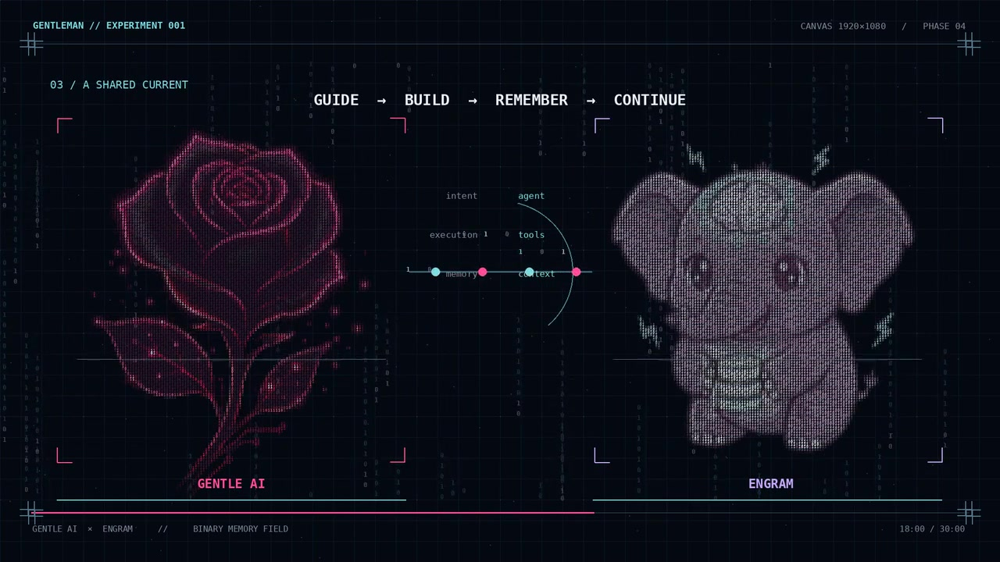

# Gentle AI × Engram — Binary Memory Field



[Watch the 30-second mobile-friendly video with “First Session”](assets/preview-mobile.mp4)

An independent, editable homepage animation concept for Gentleman Programming. The illustration is drawn on a responsive 1920 × 1080 HTML Canvas. The Gentle AI rose and Engram elephant are sampled from their original PNG artwork, then reconstructed as thousands of colored `0` and `1` glyphs. The PNGs serve as **templates only** and are not drawn over the finished art.

The 30-second narrative goes from the agent environment to persistent memory, the connection between both products, and a restored session. The current soundtrack is a 30-second edit of **“First Session”**, supplied by Maicol for this animation. Sound starts only when the visitor presses **♪**.

## Try it locally

```bash
python3 -m http.server 8000
```

Open <http://localhost:8000>. There is no build step and no external JavaScript dependency.

## Publish with GitHub Pages

For the first deployment, open this repository's **Settings → Pages** and set **Build and deployment → Source** to **GitHub Actions**. The included `Publish Canvas preview` workflow deploys on subsequent pushes to `main`; rerun its initial failed job (or dispatch the workflow manually) after enabling Pages. This initial repository setting cannot be activated by the workflow's standard `GITHUB_TOKEN`.

Controls: **↺** replay, **Ⅱ / ▶** pause/play, **↣** final scene, **♪** sound. Space pauses and the left/right arrows seek between scenes. Reduced-motion preferences open on the final frame. The Canvas keeps its 16:9 ratio on smaller screens.

## Edit it

| File | Purpose |
| --- | --- |
| `index.html` | Accessible page and controls |
| `style.css` | Layout and responsive presentation |
| `script.js` | Timeline, binary sampling, Canvas animation |
| `assets/rose.png` and `assets/engram-elephant.png` | Pixel templates for the branded glyph drawings |
| `assets/sound.mp3` | Thirty-second excerpt of “First Session,” with a short closing fade |
| `assets/preview-mobile.mp4` | H.264 Baseline 720p video with the same music; playable independently of the Canvas |
| `assets/poster.jpg` | Static preview shown while the Canvas starts and in the README |
| `tools/generate_sound.py` | Optional generator for the earlier electronic demo soundtrack; requires NumPy and FFmpeg |

To swap in a different song, create a 30-second MP3 with a closing fade and replace `assets/sound.mp3`. The original full-length “First Session” file is not included in this repository.

This is a community tribute and a proposal for the maintainers, not an official deployment or endorsement. The brand artwork originates with [Gentle AI](https://github.com/Gentleman-Programming/gentle-ai) and [Engram](https://github.com/Gentleman-Programming/engram-landing). Product names and marks belong to their respective owners.

## Binary ASCII Studio: reusable image tool

The included Python package converts **any Pillow-supported raster image** (PNG, JPEG, WebP, GIF first frame, and others) into binary ASCII. Pixel sampling preserves the source silhouette, transparent regions and color. There is no pasted raster in the exported artwork. Python 3.10+ and Pillow are required.

```bash
python3 -m pip install -e .
binary-ascii convert path/to/image.png --width 120 --format text -o art.txt
binary-ascii convert path/to/image.png --width 120 --format ansi -o art.ans
binary-ascii convert path/to/image.png --width 120 --format json -o cells.json
binary-ascii convert path/to/image.png --width 120 --format svg -o art.svg
binary-ascii convert path/to/image.png --width 120 --format png -o art.png
binary-ascii play path/to/image.png --width 90 --duration 6 --fps 20
```

Run with `python3 -m binary_ascii` instead of `binary-ascii` if using this checkout without installation. Plain text is suited to logs and monochrome CLIs; ANSI uses 24-bit color in compatible terminals; `play` uses the alternate terminal buffer for a live TUI reveal. A piped `play` emits one plain frame. `--glyphs 01` can be replaced with any two printable characters. `--cell-aspect 0.5` suits most terminal fonts, while `--cell-aspect 1` makes square source cells. `--alpha-threshold` controls transparency and `--min-luminance` lifts dark source pixels on a dark background. `--saturation 1` preserves source colors; `1.15`–`1.25` can compensate for the gaps between glyphs in a vivid poster. PNG output uses a bold monospace face when installed so colors read clearly without drawing source pixels behind the text. Grids are limited to 120,000 cells to avoid accidental memory exhaustion.

Use the Python API to integrate the sampler into another renderer:

```python
from binary_ascii import convert_image, render_text

frame = convert_image("photo.webp", columns=96, glyphs="01")
print(render_text(frame))
for x, y, glyph, red, green, blue, alpha in frame.records():
    pass  # feed your Canvas, terminal, animation, or UI
```

### Cinematic, editable Canvas presentations

Copy [the example manifest](examples/gentle-engram.json), point each scene's `image` at a local file, and set its title, caption, color, duration, layout and reveal motion. Optional `audio` must be a local MP3, M4A, OGG or WAV. See the [still preview of two binary scenes](examples/generated/poster.png). Then build an offline presentation:

```bash
binary-ascii present examples/gentle-engram.json -o my-deck
python3 -m http.server 8000 --directory my-deck
```

Open `http://localhost:8000`. Output contains `index.html` (1920 × 1080 responsive Canvas), `manifest.json` (editable manifest with copied local sources), `presentation.json` (precomputed glyph cells), and copied source images/audio. To revise, edit `my-deck/manifest.json` and rerun `binary-ascii present my-deck/manifest.json -o my-deck --force`. Music starts only with the sound button, per browser playback rules; space pauses and arrows navigate scenes. The original images are retained **only as editable source material**; the displayed presentation reconstructs them entirely from sampled 0/1 glyphs. The [generated example](examples/generated/index.html) is ready to preview locally.

Run `python3 tools/render_binary_poster.py` to regenerate the still preview from compiled binary cells and `python3 -m unittest discover -s tests -v` for functional checks.
